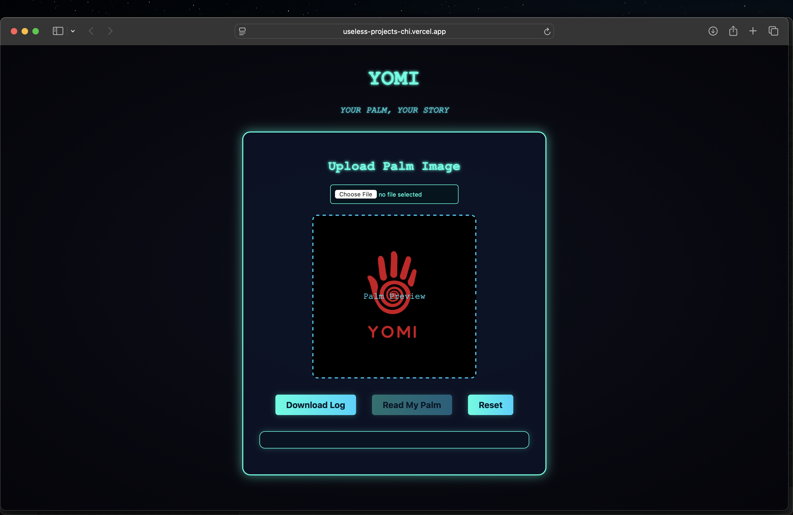
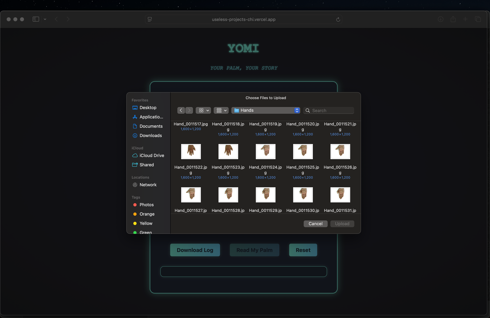

# YOMI 🎯

## Basic Details
### Team Name: Team Dragons

### Team Members
- Team Lead: Sachin Rajesh - Model Engineering College

### Project Description
The Project is an image analyser which counts the number of major lines in a palm. It depicts and expresses how much a project can be creative and useless at the same time

### The Problem (that doesn't exist)
It is much difficult for atleast a few of us to count the number of lines in our hand. But here we try to solve the problem with just a click

### The Solution (that nobody asked for)
Here we chose simple frontend and backend methods to solve the issue of counting of lines in our palm

## Technical Details
### Technologies/Components Used
For Software:
- Languages : HTML , CSS , JAVASCRIPT
- Tools used : Chatgpt, Deepseek, Kaggle

### Implementation
For Software: Vercel App

### Project Documentation
For Software: Github

# Screenshots (Add at least 3)

*This is what we can see when get into the website*

*We are trying to upload a palm image into the memory*

*The result provides the count of the major lines in our palm*

### Project Demo
# Video
[The working of the Yomi Counter](screenrecord.mp4)
<video src="https://github.com/SachinRajesh22/Useless-Projects/screenrecord.mp4" controls></video>
*It basically shows how the project works. It depicts a photo being uploaded and the corresponding number of lines in the palm is given as output*

---
Made with ❤️ at TinkerHub Useless Projects 

# Useless-Projects
